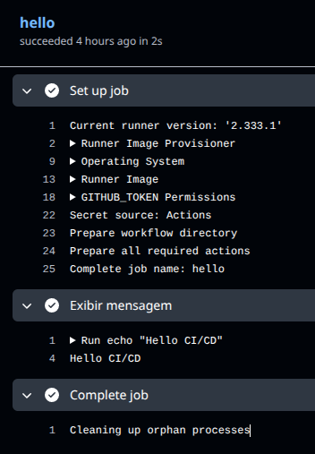
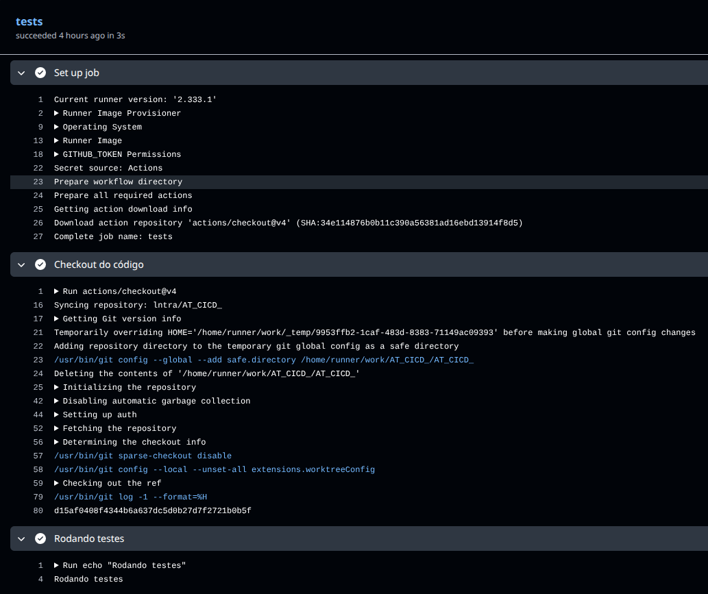
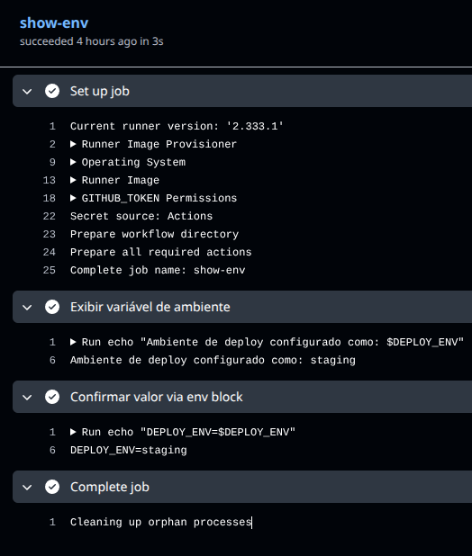
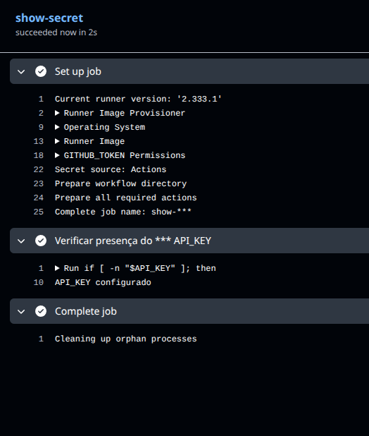

# AT – CI/CD e DevOps — Respostas e Evidências

**Imagem Docker Hub:** https://hub.docker.com/r/infnetfernando/ufotracker

## Missão 4 – Implantando a aplicação no cluster

## Parte 2 – Workflows Básicos no GitHub Actions

Todos os workflows estão em `.github/workflows/` na raiz do repositório.  
🔗 https://github.com/lntra/AT_CICD_/actions

---

### `hello.yml` — Hello CI/CD

**Disparo:** qualquer `push`

```yaml
name: Hello Workflow

on:
  push:

jobs:
  hello:
    runs-on: ubuntu-latest
    steps:
      - name: Exibir mensagem
        run: echo "Hello CI/CD"
```

**Log:**



---

### `tests.yml` — Rodando testes

**Disparo:** `pull_request`

```yaml
name: Tests Workflow

on:
  pull_request:

jobs:
  tests:
    runs-on: ubuntu-latest
    steps:
      - name: Checkout do código
        uses: actions/checkout@v4

      - name: Rodando testes
        run: echo "Rodando testes"
```

**Log:**



> **Para disparar:** crie um Pull Request em https://github.com/lntra/AT_CICD_

---

### `gradle-ci.yml` — Build CI

**Disparo:** push na branch `main`

```yaml
name: Build CI

on:
  push:
    branches:
      - main

jobs:
  build:
    runs-on: ubuntu-latest
    steps:
      - name: Checkout do código
        uses: actions/checkout@v4

      - name: Configurar Java
        uses: actions/setup-java@v4
        with:
          distribution: temurin
          java-version: '21'

      - name: Build (Gradle ou Maven)
        run: |
          cd ufoTracker
          if [ -f ./gradlew ]; then
            chmod +x ./gradlew
            ./gradlew build -x test
          else
            chmod +x ./mvnw
            ./mvnw -B clean package -DskipTests
          fi
```

---

## Parte 3 – Runners, Variáveis e Segurança

### `env-demo.yml` — Variável de ambiente

**Disparo:** qualquer `push`

```yaml
name: env-demo

on:
  push:

env:
  DEPLOY_ENV: staging

jobs:
  show-env:
    runs-on: ubuntu-latest
    steps:
      - name: Exibir variável de ambiente
        run: |
          echo "Ambiente de deploy configurado como: $DEPLOY_ENV"

      - name: Confirmar valor via env block
        env:
          DEPLOY_ENV: ${{ env.DEPLOY_ENV }}
        run: |
          echo "DEPLOY_ENV=$DEPLOY_ENV"
```

**Log:**



---

### `secret-demo.yml` — Secret seguro

**Disparo:** qualquer `push`

**Pré-requisito:** configurar o secret `API_KEY` em:  
https://github.com/lntra/AT_CICD_/settings/secrets/actions → _New repository secret_

```yaml
name: secret-demo

on:
  push:

jobs:
  show-secret:
    runs-on: ubuntu-latest
    steps:
      - name: Verificar presença do secret API_KEY
        env:
          API_KEY: ${{ secrets.API_KEY }}
        run: |
          if [ -n "$API_KEY" ]; then
            echo "API_KEY configurado"
          else
            echo "API_KEY não encontrado ou vazio"
          fi
```

**Log:**



---

### Diferença entre Runners hospedados pelo GitHub e Auto-hospedados

#### Runners hospedados pelo GitHub (_GitHub-hosted runners_)

GitHub-hosted runners: são máquinas virtuais do próprio GitHub que já vêm prontas. Você não precisa configurar nada, o ambiente é limpo a cada execução e funciona bem pra maioria dos projetos. Em troca, tem limite de minutos, não dá acesso à rede interna e o hardware não é customizável.

---

#### Runners auto-hospedados (_Self-hosted runners_)

Self-hosted runners: são máquinas suas (ou da empresa) conectadas ao GitHub. Você tem controle total do hardware e acesso à rede interna, sem limite de minutos. Em compensação, precisa cuidar da manutenção, segurança e evitar problemas de ambiente sujo entre execuções.

